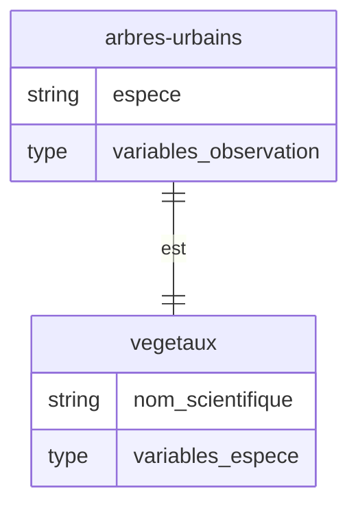

# Schéma sur les végétaux

<p align=center></p>


Ce standard de données vise à caractériser les espèces végétales de façon normalisée, ceci afin de déterminer les services écosystémiques qu'elles rendent à la ville, à celles et ceux qui l'habitent, de quelque espèce qu'ils soient (insectes, oiseaux, humains, ...)

| ▶ [Consulter le schéma](schema.md) | 📝 [Voir un fichier exemple](sesame13.csv) | ⚙[Voir le schéma au format TableSchema](schema.json) |
| ---------------------------------- | ----------------------------------------- | ---------------------------------------------------- |

## 🌳 Lien avec le projet Sesame 13

<p align=center></p>

Ce schéma de données a été développé dans le cadre du projet [Sesame 13](https://www.departement13.fr/le-departement/linstitution/retour-sur/detail/article/un-nouvel-outil-pour-mieux-vegetaliser-nos-villes/) qui vise à caractériser les espèces végétales sur le département des Bouches-du-Rhône.

Sesame 13 a abouti à une base de données ouverte et à une application d'exploration et d'identification des espèces et des services qu'elles rendent.

Ce projet a été développé en partenariat entre le Cerema, l'INRAE Villa Thuret et le Conseil Départemental des Bouches-du-Rhône.

## ❓ À propos du schéma

Ce standard comprend 73 informations, parmi lesquelles :

- La **hauteur** de l'arbre
- La **largeur** du houppier
- Le **type** de feuille (aiguille, ...)
- La vitesse de **croissance**
- Les **dégâts** causés par les racines
- La **résistance** à la sécheresse
- Le niveau **d'inflammabilité**
- Le caractère **comestible** ou l'utilisation en **infusion**
- La période de **floraison**
- Le caractère **allergisant** voire **toxique**

## 🎯 Objectifs

Le schéma sur les végétaux vise à proposer **une structure normalisée** selon laquelle caractériser les espèces végétales, dans le but de :

- Créer sa propre **base locale** et la **partager**
- **Qualifier** et **enrichir** les informations des contributeurs de façon croisée
- Et pourquoi pas **contribuer** à une base de données **globale** sur les espèces végétales.

## 🏙 Schéma sur les arbres urbains

Ce standard se joint aisément avec [le schéma sur les arbres urbains](https://schema.data.gouv.fr/NaturalSolutions/schema-arbre/) visant le recensement des arbres en milieu urbain grâce au champ [espece](https://schema.data.gouv.fr/NaturalSolutions/schema-arbre/0.3.1/documentation.html#propriete-espece) donnant nom scientifique de l'espèce.



Combiner inventaire des arbres, cadastre arboré selon l'espèce et description des espèces ouvre la voie à une meilleure connaissance et à un meilleur aménagement pour l'arbre en ville, connaissant la nature locale des enjeux (îlots de fraîcheur, continuité écologique, ...) et les services que certaines espèces rendent.

## 💡 Conseils

### `nom_scientifique`

Pour `nom_scientifique`, utiliser préférentiellement la nomenclature du site [POWO](https://powo.science.kew.org/) (Plants Of the World Online)

### `ID`

Pour `ID`, il est possible d'utiliser l'identifiant [GBIF](https://www.gbif.org/fr/)

### Champs à valeurs multiples

Les champs à valeurs multiples sont de type `array` (liste). C'est par exemple le cas du champ `sols_texture` (besoins de texture)

Pour mentionner plusieurs valeurs, utiliser la nomenclature suivante :

```
"[""Gravier/roches"",""Sable"",""Limon""]"
```

Dans ce cas, l'espèce convient aux sols sableux, limonneux et rocheux.

## ✉ Contact

Une question ? Contactez-nous à xxx
